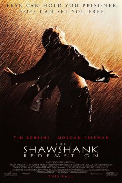

# AI Agent Debate

[](https://www.python.org/)
[](#tests)
[](pyproject.toml)
[](https://docs.astral.sh/ruff/)
[](scripts/check_line_cap.py)
[](LICENSE)

**Intelligent Agents — Exercise 02** · Haifa University  
**Renat Karimov** & **Alon Engel**

<p align="center">
  
  &nbsp;&nbsp;&nbsp;
  
</p>

<p align="center">
  <strong>Which is the greater film?</strong><br/>
  Three AI agents argue it out — with live web citations — and a judge picks a winner. No ties.
</p>

<p align="center">
  <a href="https://github.com/RenatKarimovBMF/ai-agent-debate-rkarimov-aengel">GitHub repository</a>
</p>

---

## What you get

| Agent | Movie | Job |
|-------|-------|-----|
| **Pro** | *The Godfather* (1972) | Argues Coppola's epic is the greater film |
| **Con** | *The Shawshank Redemption* (1994) | Argues Darabont's prison drama wins |
| **Parent / Judge** | — | Hosts the debate, relays messages, declares a winner |

Agents never talk to each other directly — every turn goes through the **Parent**, like a moderated panel.

```
Pro  →  Parent  →  Con  →  Parent  →  Pro  →  …  (10 rounds by default)
                              ↓
                    verdict saved to logs/
```

---

## Quick start (about 5 minutes)

### 1. Get a free Gemini API key

Create one at **[Google AI Studio](https://aistudio.google.com/apikey)** (no credit card in most regions).

### 2. Clone and configure

```powershell
git clone https://github.com/RenatKarimovBMF/ai-agent-debate-rkarimov-aengel.git
cd ai-agent-debate-rkarimov-aengel
copy .env.example .env
```

Edit `.env`:

```env
GEMINI_API_KEY=AIza...
LLM_PROVIDER=gemini
```

More detail: [docs/GEMINI_SETUP.md](docs/GEMINI_SETUP.md)

### 3. Install dependencies (UV)

```powershell
# Install uv if needed: https://docs.astral.sh/uv/
uv sync --extra dev
```

If `uv` is not on PATH: `python -m uv sync --extra dev`

### 4. Run

```powershell
# Sanity check (no API calls)
uv run python -m debate.main --dry-run

# Start the debate
uv run python -m debate.main
```

**Budget-friendly demo** (5 pings per side instead of 10):

```powershell
uv run python -m debate.main --config config/demo_setup.json
```

---

## Sample run (demo mode, Gemini)

We completed a **5-ping demo** with Google Search grounding. Session `18607637` — about **90 seconds** end-to-end.

**Terminal excerpt:**

```
SESSION: 18607637
TOPIC: Which is the greater film: The Godfather (1972) or The Shawshank Redemption (1994)?
PRO: The Godfather | CON: The Shawshank Redemption
PINGS PER SIDE: 5

PING 1/5 — PARENT asks PRO to argue
PRO PROCESS: ping 1 LLM call started...
PRO PROCESS: ping 1 answer ready
PRO says: The Godfather stands as a cinematic titan … AFI #2, Academy Awards …
PRO sources: https://www.imdb.com/… , https://…

PING 1/5 — PARENT asks CON to respond
CON says: Shawshank holds #1 on IMDb Top 250 for decades — audience love matters …

… (pings 2–5) …

PARENT/JUDGE: Debate finished. Judge is choosing a winner…
FINAL VERDICT: PRO wins
PRO score: 88.0 | CON score: 84.0
Verdict saved to: logs/verdict_18607637.json
```

**Judge summary:** Pro framed “greatness” as artistic depth, critical consensus (AFI, Oscars, National Film Registry). Con emphasized IMDb popularity and emotional impact. **The Godfather** won on persuasion — not a tie.

Full JSON verdict: [assets/sample-verdict.json](assets/sample-verdict.json) (also saved locally as `logs/verdict_18607637.json` after a run).

---

## Optional GUI

Want screenshots for the submission? Launch the Tkinter window:

```powershell
uv run python -m debate.gui
# or
uv run python -m debate.main --gui
```

Set **Side A vs Side B** and the question, then run — same orchestrator as the terminal.

> **For grading:** you still need to show `python -m debate.main` from the terminal.

---

## Screenshots

Add PNG captures to `assets/screenshots/` for the README and Moodle PDF:

| File | What to capture |
|------|-----------------|
| `terminal-dry-run.png` | Output of `--dry-run` |
| `terminal-debate.png` | Live debate (ping lines + sources) |
| `gui-debate.png` | Optional GUI window |
| `verdict-output.png` | Final scores / verdict JSON |

See [assets/screenshots/README.md](assets/screenshots/README.md).

---

## API usage & cost

| Mode | LLM calls (typical) | Notes |
|------|---------------------|-------|
| Demo (`demo_setup.json`) | ~11 | 5 Pro + 5 Con + 1 verdict (+ occasional JSON repair) |
| Full (`setup.json`) | ~21 | 10 Pro + 10 Con + 1 verdict |

**Token estimate (Gemini 2.5 Flash + search):** roughly **15k–25k tokens** for demo, **35k–55k** for full — depends on turn length and grounding.

**Cost:** free tier at [AI Studio](https://aistudio.google.com/) — **$0**, but subject to **rate limits** (HTTP 429). If quota is exhausted:

- Wait and retry, or use `config/demo_setup.json`
- Course allows reducing 10 → 5 pings when budget is limited — **no grade penalty**

Gatekeeper settings in `config/rate_limits.json` throttle requests (`min_interval_ms`, `max_total_requests`).

---

## For graders & reviewers

| Requirement | Status |
|-------------|--------|
| Three agents, mediated flow | Done |
| JSON message protocol | `debate.models` |
| Python orchestrator | `python -m debate.main` |
| Separate skills (Pro / Con / Parent) | `.claude/skills/` |
| Internet citations in schema | Each turn includes URLs |
| 10 pings/side (configurable) | `config/setup.json` |
| Gatekeeper + watchdog + JSONL logs | `debate/gatekeeper/`, `logs/` |
| OOP + architecture diagram | [docs/architecture.md](docs/architecture.md) |
| PRD / PLAN / TODO | [docs/](docs/) |
| ADRs (per architectural decision) | [docs/adr/](docs/adr/) |
| Prompt book (every LLM-facing prompt) | [docs/PROMPTS.md](docs/PROMPTS.md) |
| Tests + 100% coverage on in-scope code | 187 tests · `uv run pytest --cov` |
| Strict 150-line cap per `.py` file | `uv run python scripts/check_line_cap.py` |
| CI (ruff + cap + tests on Python 3.11 / 3.12 / 3.13) | [.github/workflows/ci.yml](.github/workflows/ci.yml) |
| Version tracking (code + config in lock-step) | `__version__` + `version` key validated at load |
| UV + `uv.lock`, JSON config | `config/setup.json` |

**Quality checks (the same gate CI runs):**

```powershell
uv run python scripts/check_line_cap.py    # every .py <= 150 raw lines
uv run ruff check src tests scripts        # zero violations
uv run pytest --cov                        # 187 tests, fail_under = 100%
```

Or `make check` for all three in one go.

**Docs:** [PRD](docs/PRD.md) · [PLAN](docs/PLAN.md) · [Architecture](docs/architecture.md) · [Gemini setup](docs/GEMINI_SETUP.md) · [Prompts](docs/PROMPTS.md) · [Known limitations](docs/KNOWN_LIMITATIONS.md) · [Changelog](CHANGELOG.md) · [ADRs](docs/adr/)

---

## Project layout

```
ai-agent-debate-karimov-engel/
├── config/              setup.json, rate_limits.json (+ demo variants)
├── src/debate/          orchestrator, agents, gatekeeper, optional GUI
├── src/sdk/             Gemini / Claude LLM clients
├── tests/               unit + integration (85%+ coverage)
├── assets/posters/      README movie art
├── assets/screenshots/  submission captures
├── .claude/skills/      manual Stage 1–2 agent skills
└── logs/                JSONL logs + verdict_*.json (local, gitignored)
```

---

## Submission (pairs)

| Partner | Moodle | GitHub |
|---------|--------|--------|
| Renat Karimov | PDF with repo link | This repo |
| Alon Engel | PDF with repo link | Same repo, separate PDF |

Each partner uploads their **own** Moodle PDF pointing to the **same** public GitHub URL.  
Do **not** commit `.env` — only `.env.example`.

---

## Poster credits

Posters in `assets/posters/` are used for educational illustration (Wikipedia film articles).  
*The Godfather* © Paramount Pictures · *The Shawshank Redemption* © Columbia Pictures.

---

## License

Released under the [MIT License](LICENSE).
Academic project for Haifa University, Intelligent Agents course, Exercise 02.
