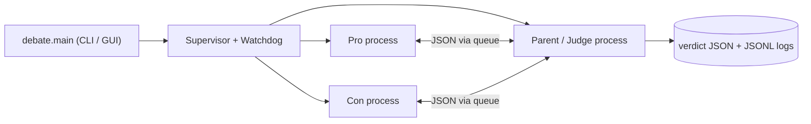
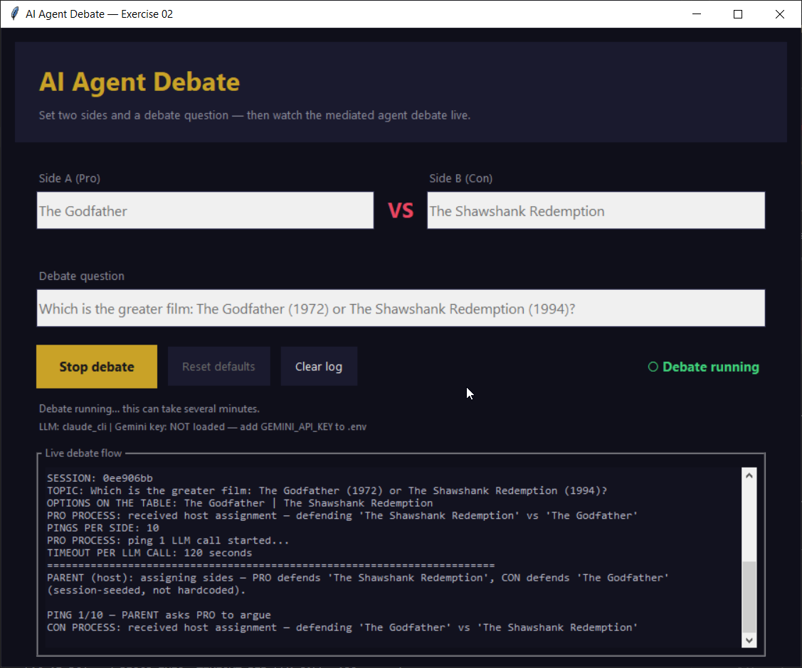
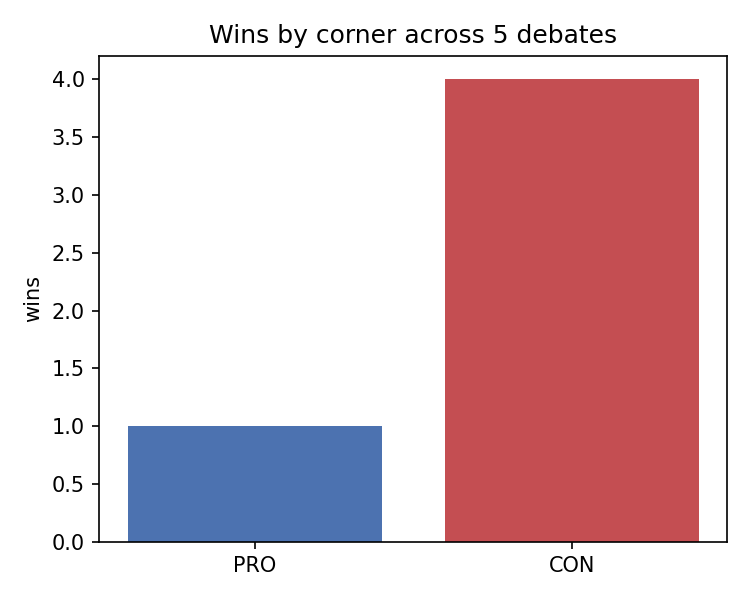
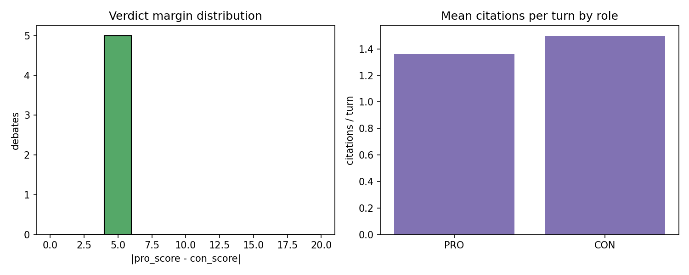

# AI Agent Debate

[](https://www.python.org/)
[](#tests)
[](pyproject.toml)
[](https://docs.astral.sh/ruff/)
[](https://mypy-lang.org/)
[](scripts/check_line_cap.py)
[](LICENSE)

**Intelligent Agents — Exercise 02** · Haifa University  
**Renat Karimov** & **Alon Engel**

<p align="center">
  
  &nbsp;&nbsp;&nbsp;
  
</p>

<p align="center">
  <strong>Which is the greater film — The Godfather or The Shawshank Redemption?</strong><br/>
  Three AI agents argue it out — each turn backed by a cited source — and a judge picks a winner. No ties.<br/>
  <em>That's the default debate; the engine is topic-agnostic — point it at any motion with <code>--topic</code>.</em>
</p>

<p align="center">
  <a href="https://github.com/RenatKarimovBMF/ai-agent-debate-rkarimov-aengel">GitHub repository</a>
</p>

---

## Table of contents

- [Features](#features)
- [How it works](#how-it-works)
- [Quick start](#quick-start-about-5-minutes)
- [Sample run](#sample-run)
- [Optional GUI](#optional-gui)
- [Screenshots](#screenshots)
- [API usage & cost](#api-usage--cost)
- [Research & analysis](#research--analysis)
- [For graders & reviewers](#for-graders--reviewers)
- [Project layout](#project-layout)
- [Submission](#submission-pairs)

---

## Features

- **Mediated multi-agent debate** — `Pro`, `Con`, and a `Parent/Judge`; debaters never talk to each other, every turn is relayed through the Parent.
- **Real OS-level multiprocessing** — three `spawn`ed worker processes exchanging JSON messages over queues, run by a supervisor with a per-process watchdog (keepalive + restart).
- **Runtime side assignment** — the Parent assigns sides per session, seeded by the session id, so they vary across runs and are never hardcoded.
- **Topic-agnostic engine** — ships with the film debate as the default, but runs any motion via `--topic`.
- **Three LLM providers, auto-selected** — Claude CLI (subscription) → Anthropic API → Gemini (free tier), or force one with `LLM_PROVIDER`.
- **Research-backed judging** — a WUDC / IDEA / NSDA-derived rubric (Matter 30 · Clash 25 · Manner 15 · Method 15 · Burden 15 = 100) and five judging principles; **no ties allowed**. Full scoring system: [docs/PRD_judge_rubric.md §3](docs/PRD_judge_rubric.md).
- **Refute-with-citation rule** — lies are permitted, but a bare contradiction is not a refutation; alleging a falsehood requires a cited source in the same turn.
- **Judge mid-debate intervention** — after each turn the Parent runs an anti-capitulation check; if a debater is being swept into agreement it issues a ringside warning and re-requests the turn, so the clash never collapses.
- **Web-search grounding on every provider** — Claude CLI's built-in WebSearch, Gemini's Google Search grounding (`use_google_search`), and Anthropic's managed `web_search` tool (`anthropic_web_search`) — all config-driven.
- **Project-local Agent Skills** — six skills under `.claude/skills/`, loaded natively by the Claude CLI and injected into the prompt for the API providers.
- **Gatekeeper + structured logging** — config-driven rate/budget limits; rotating JSONL logs and a machine-readable JSON verdict.
- **Research & analysis layer** — a tested `debate.analysis` module plus `notebooks/analysis.ipynb` chart win-rate by corner, verdict margins, and citations per turn from real run logs (`uv sync --extra analysis`).
- **Fully config-driven** — every knob lives in versioned JSON; the version is validated against the code at load.
- **Strong quality bar** — genuine **100% test coverage** (281 tests), `ruff` + `mypy` clean, every `.py` ≤ 150 lines, CI on Python 3.11–3.13.

---

## How it works

| Agent | Role | Job |
|-------|------|-----|
| **Pro** | Debater | Defends whichever side the Parent assigns at session start |
| **Con** | Debater | Defends the opposing side |
| **Parent / Judge** | Host | Assigns the sides, relays every message, declares a winner |

The two sides come from config (default: *The Godfather* vs *The Shawshank Redemption*), but **the Parent decides which agent defends which side at runtime** — seeded by the session id, so it varies across runs and is never hardcoded. Agents never talk to each other directly — every turn goes through the **Parent**, like a moderated panel.



Each ping is one LLM call per side, serialized through the Parent: `Pro → Parent → Con → Parent → …` for 10 rounds by default, after which the Parent scores the transcript and writes a no-tie verdict to `logs/`. Full design: [docs/architecture.md](docs/architecture.md) · [docs/PLAN.md](docs/PLAN.md).

---

## Quick start (about 5 minutes)

### 1. Choose an LLM provider

The debate needs one LLM. The app auto-selects in priority order `claude_cli → anthropic → gemini`, or you can force one with `LLM_PROVIDER`:

| Provider | Cost | Setup | `LLM_PROVIDER` |
|----------|------|-------|----------------|
| **Claude CLI** (recommended) | Uses your Claude Pro/Max login — no per-call cost | `npm i -g @anthropic-ai/claude-code`, then run `claude` once to log in | `claude_cli` |
| **Anthropic API** | Pay-as-you-go | Key from [console.anthropic.com](https://console.anthropic.com) → `ANTHROPIC_API_KEY` | `anthropic` |
| **Google Gemini** | Free tier (Flash only, ~250 req/day) | Key from [AI Studio](https://aistudio.google.com/apikey) → `GEMINI_API_KEY` | `gemini` |

We recommend **Claude** — a Pro/Max subscription gives high-quality, detailed turns at no per-call cost (the worked example in [examples/](examples/) used it; setup: [docs/CLAUDE_SETUP.md](docs/CLAUDE_SETUP.md)). The **Gemini free tier works and costs nothing, but it is noticeably less accurate and less detailed**, so it is not recommended for a representative run.

### 2. Clone and configure

```powershell
git clone https://github.com/RenatKarimovBMF/ai-agent-debate-rkarimov-aengel.git
cd ai-agent-debate-rkarimov-aengel
copy .env.example .env
```

Edit `.env` for your chosen provider — e.g. Gemini:

```env
GEMINI_API_KEY=AIza...
LLM_PROVIDER=gemini
```

…or Claude via the CLI (no API key, after `claude` login):

```env
LLM_PROVIDER=claude_cli
```

Gemini-specific detail: [docs/GEMINI_SETUP.md](docs/GEMINI_SETUP.md)

### 3. Install dependencies (UV)

```powershell
# Install uv if needed: https://docs.astral.sh/uv/
uv sync --extra dev
```

If `uv` is not on PATH: `python -m uv sync --extra dev`

### 4. Run

```powershell
# Sanity check (no API calls)
uv run python -m debate.main --dry-run

# Start the debate
uv run python -m debate.main
```

**Budget-friendly demo** (5 pings per side instead of 10):

```powershell
uv run python -m debate.main --config config/demo_setup.json
```

---

## Sample run

A complete, unedited **10-ping** session (`00baf1b0`) on the Claude provider — ~9 minutes end-to-end, 21 LLM calls. The Parent assigned PRO to *The Godfather* and CON to *Shawshank* at runtime, and **The Godfather (PRO) won 81–77**. (An earlier run, `fe14afde`, assigned the sides the other way and *The Godfather* still won as CON — the assignment really does vary per session.)

**Terminal excerpt:**

```
SESSION: 00baf1b0
TOPIC: Which is the greater film: The Godfather (1972) or The Shawshank Redemption (1994)?
OPTIONS ON THE TABLE: The Godfather | The Shawshank Redemption
PINGS PER SIDE: 10
PARENT (host): assigning sides — PRO defends 'The Godfather',
               CON defends 'The Shawshank Redemption' (session-seeded, not hardcoded).

PING 1/10 — PARENT asks PRO to argue
PRO says: Let us define the standard. 'Greater' film … must mean the work of
          larger artistic consequence … The Godfather rewrote the grammar of
          the gangster genre … (AFI; National Film Registry, 1990)…
PRO sources: https://www.afi.com/afis-100-years-100-movies/, https://www.loc.gov/item/prn-15-232/

PING 1/10 — PARENT asks CON to respond
CON says: Greatness must include the verdict of the global audience … The
          Shawshank Redemption has held the No. 1 position on IMDb's Top 250…
CON sources: https://www.loc.gov/programs/national-film-preservation-board/film-registry/, https://www.imdb.com/chart/top/

… (pings 2–10; the round turns on the AFI #2-vs-#72 expert-consensus clash) …

PARENT/JUDGE: Debate finished. Judge is choosing a winner…
FINAL VERDICT: PRO wins
PRO score: 81.0
CON score: 77.0
Verdict saved to: logs/verdict_00baf1b0.json
```

**Judge summary:** A narrow round. CON landed the cleanest cited refutation — using the Library of Congress's own words that the National Film Registry is *not* a ranking — but PRO took the decision on Clash: it turned CON's IMDb anchor (The Godfather sits #2 on the same list), then held uncontested expert consensus (AFI #2 vs. Shawshank #72 on the same 2007 ballot, the 1973 Oscar sweep). CON impugned the AFI jury but never produced a rival expert ranking. No tie — 81 to 77.

**The full session is documented in [examples/godfather-vs-shawshank/](examples/godfather-vs-shawshank/):** the [write-up](examples/godfather-vs-shawshank/README.md), the [turn-by-turn transcript](examples/godfather-vs-shawshank/transcript.md), and the [verdict JSON](examples/godfather-vs-shawshank/verdict.json). A second worked example on a **custom topic** (abortion legality, via `--topic`) lives in [examples/abortion-legality/](examples/abortion-legality/) — see [examples/](examples/) for the index. (`assets/sample-verdict.json` is a minimal schema sample.)

---

## Optional GUI

Want screenshots for the submission? Launch the Tkinter window:

```powershell
uv run python -m debate.gui
# or
uv run python -m debate.main --gui
```

Set **Side A vs Side B** and the question, then run — same orchestrator as the terminal. While a debate is live, the **Start debate** button turns into **Stop debate** (which cancels the run cleanly) and a blinking "● Debate running" indicator shows it is active. See the [screenshot](#screenshots) below.

> **For grading:** you still need to show `python -m debate.main` from the terminal.

---

## Screenshots

The optional Tkinter GUI running a live debate (the **Start debate** button
becomes **Stop debate** while a round is in progress, with a blinking
"● Debate running" indicator):



More captures can be added to `assets/screenshots/` for the Moodle PDF
(`terminal-dry-run.png`, `terminal-debate.png`, `verdict-output.png`); the
terminal flow is also fully documented in [examples/](examples/). See
[assets/screenshots/README.md](assets/screenshots/README.md).

---

## API usage & cost

| Mode | LLM calls | Notes |
|------|-----------|-------|
| Demo (`demo_setup.json`) | ~11 | 5 Pro + 5 Con + 1 verdict (+ occasional JSON repair) |
| Full (`setup.json`) | ~21 | 10 Pro + 10 Con + 1 verdict |

**Measured — full run, session `fe14afde` (`claude_cli`):** exactly **21 LLM calls** (20 debate turns + 1 verdict), **0 JSON-repair retries**, **~7m57s** wall-clock — roughly **15–35s per turn** (one LLM call at a time, serialized through the Parent). See [examples/](examples/).

**Token estimate (Gemini 2.5 Flash + search):** roughly **15k–25k tokens** for demo, **35k–55k** for full — depends on turn length and grounding. (The CLI providers don't report token counts; this is a Gemini-only estimate.)

**Per-model cost analysis.** Marginal cost of one **full** debate (~21 calls; ~35k input + ~15k output tokens from the estimate above). Figures are **approximate provider list prices as of 2026-05** — check each provider's pricing page for current rates:

| Provider / model | Input ($/M tok) | Output ($/M tok) | Web search | Est. cost / full debate |
|------------------|----------------:|-----------------:|------------|------------------------:|
| **Claude Pro/Max via CLI** (recommended) | — | — | included in plan | **$0 marginal** (counts against the $20/mo plan) |
| Anthropic API — Claude Sonnet | ~$3 | ~$15 | ~$10 / 1k searches | **~$0.35–0.60** |
| Gemini 2.5 Flash (paid) | ~$0.30 | ~$2.50 | billed per grounded req | **~$0.05–0.10** |
| Gemini 2.5 Flash (free tier) | $0 | $0 | $0 | **$0** (≤ ~250 req/day) |

**Optimization strategies** (how this project keeps token cost down):

- **Prefer the Claude subscription** (`claude_cli`) — $0 marginal cost per call.
- **Demo config** (`demo_setup.json`, 5 pings) roughly halves calls during development.
- **Gatekeeper** caps total and per-agent requests and enforces a minimum inter-call interval (`config/rate_limits.json`).
- **JSON-only protocol + 280-word cap** bound output tokens per turn.
- **One LLM call per turn** (no multi-pass planner/critic) keeps usage predictable.
- **Skills load natively on the Claude CLI**; only the API providers pay the few-KB prompt-injection overhead (KNOWN_LIMITATIONS L-09).

**Cost & limits.** You can run the project on a paid subscription or for free; the provider is auto-selected (`claude_cli → anthropic → gemini`):

- **Claude Pro/Max subscription (recommended).** A **Claude Pro** plan ($20/month) via `claude_cli` has **no per-call charge** — usage counts against Claude's rolling limits. In our full 10-ping run we used **under 10% of the 5-hour window** and **~1% of the weekly allowance**, so you can comfortably run many debates per month.
- **Free tier (Gemini).** Free at [AI Studio](https://aistudio.google.com/) — **$0**, but with real caveats. The free tier serves **Flash models only** (`gemini-2.5-flash` and lighter fallbacks — the fast, low-cost Gemini, *not* the more capable Pro tier) and caps you at roughly **250 requests/day** with tight rate limits (HTTP 429). Because of the Flash model, a free run is **noticeably less accurate and less detailed** than Claude, and the daily cap can interrupt a full debate. We recommend it only when a subscription isn't an option.

If you hit a limit: wait and retry, or use `config/demo_setup.json` (5 pings). The course allows reducing 10 → 5 pings — **no grade penalty**.

Gatekeeper settings in `config/rate_limits.json` throttle requests (`min_interval_ms`, `max_total_requests`).

---

## Research & analysis

A thin Jupyter notebook, [`notebooks/analysis.ipynb`](notebooks/analysis.ipynb), turns saved run artifacts (`examples/` + `logs/`) into charts. All parsing/aggregation lives in the unit-tested `debate.analysis` module, so the notebook only loads and plots.

```powershell
uv sync --extra analysis
uv run jupyter nbconvert --to notebook --execute --inplace notebooks/analysis.ipynb
```

It answers three research questions — **side bias** (does the runtime-assigned corner win evenly?), **verdict margin** (how decisive are rounds?), and **evidence discipline** (citations per turn by role) — and documents an OAT sensitivity sweep over `pings_per_side`. Generated figures land in `results/`:

| Win-rate by corner | Margins & citations |
|--------------------|---------------------|
|  |  |

Add more runs (each writes a `verdict_<id>.json` + `transcript_<id>.md` to `logs/`) and re-execute the notebook to strengthen the statistics.

---

## For graders & reviewers

| Requirement | Status |
|-------------|--------|
| Three agents, mediated flow | Done |
| JSON message protocol | `debate.models` |
| Python orchestrator | `python -m debate.main` |
| Separate skills (Pro / Con / Parent) | `.claude/skills/` |
| Internet citations in schema | Each turn includes URLs |
| 10 pings/side (configurable) | `config/setup.json` |
| Gatekeeper + watchdog + JSONL logs | `debate/gatekeeper/`, `logs/` |
| OOP + architecture diagram | [docs/architecture.md](docs/architecture.md) |
| PRD / PLAN / TODO | [docs/](docs/) |
| ADRs (per architectural decision) | [docs/adr/](docs/adr/) |
| Prompt book (every LLM-facing prompt) | [docs/PROMPTS.md](docs/PROMPTS.md) |
| Tests + 100% coverage (every runtime module; omit list empty) | 266 tests · `uv run pytest --cov` |
| Strict 150-line cap per `.py` file | `uv run python scripts/check_line_cap.py` |
| CI (ruff + mypy + cap + tests on Python 3.11 / 3.12 / 3.13) | [.github/workflows/ci.yml](.github/workflows/ci.yml) |
| Type checking (mypy) | `uv run mypy src` (core; Tk GUI scoped out) |
| Version tracking (code + config in lock-step) | `__version__` + `version` key validated at load |
| UV + `uv.lock`, JSON config | `config/setup.json` |

**Quality checks (the same gate CI runs):**

```powershell
uv run python scripts/check_line_cap.py    # every .py <= 150 raw lines
uv run ruff check src tests scripts        # zero violations
uv run mypy src                            # type-check (GUI scoped out)
uv run pytest --cov                        # 266 tests, fail_under = 100%
```

Or `make check` for all three in one go.

**Docs:** [PRD](docs/PRD.md) · [PLAN](docs/PLAN.md) · [Architecture](docs/architecture.md) · [Claude setup](docs/CLAUDE_SETUP.md) · [Gemini setup](docs/GEMINI_SETUP.md) · [Prompts](docs/PROMPTS.md) · [Known limitations](docs/KNOWN_LIMITATIONS.md) · [Changelog](CHANGELOG.md) · [ADRs](docs/adr/)

---

## Project layout

```
ai-agent-debate-rkarimov-aengel/
├── config/                 setup.json, rate_limits.json (+ demo variants, version-stamped)
├── src/debate/             orchestrator, agents, gatekeeper, transport, GUI, watchdog
├── src/sdk/                Gemini / Anthropic / Claude-CLI LLM clients
├── tests/unit/             263 targeted unit tests (each file < 150 lines)
├── tests/integration/      3 tests (config scaffold + end-to-end debate)
├── scripts/                check_line_cap.py (150-line gate)
├── docs/                   PRD, PLAN, TODO, PROMPTS, KNOWN_LIMITATIONS, architecture
├── docs/adr/               10 architectural decision records + index
├── examples/               two worked 10-ping debates (default + custom topic): write-up, transcript, verdict
├── .claude/skills/         project-local agent skills (debaters + parent/judge)
├── .github/                CI workflow + PR/issue templates
├── assets/posters/         README movie art
├── assets/screenshots/     submission captures
├── logs/                   JSONL logs + verdict_*.json (local, gitignored)
├── AUTHORS.md              team
├── CHANGELOG.md            Keep-a-Changelog (v1.00 baseline)
├── CONTRIBUTING.md         dev workflow + quality gates
├── LICENSE                 MIT
├── Makefile                uv wrappers (install / test / lint / cap / check / run / gui)
├── .pre-commit-config.yaml ruff + line-cap on every commit
├── pyproject.toml          dependencies + coverage gate (fail_under = 100)
└── uv.lock                 pinned dependency graph
```

---

## Submission (pairs)

| Partner | Moodle | GitHub |
|---------|--------|--------|
| Renat Karimov | PDF with repo link | This repo |
| Alon Engel | PDF with repo link | Same repo, separate PDF |

Each partner uploads their **own** Moodle PDF pointing to the **same** public GitHub URL.  
Do **not** commit `.env` — only `.env.example`.

---

## Poster credits

Posters in `assets/posters/` are used for educational illustration (Wikipedia film articles).  
*The Godfather* © Paramount Pictures · *The Shawshank Redemption* © Columbia Pictures.

---

## License

Released under the [MIT License](LICENSE).
Academic project for Haifa University, Intelligent Agents course, Exercise 02.
