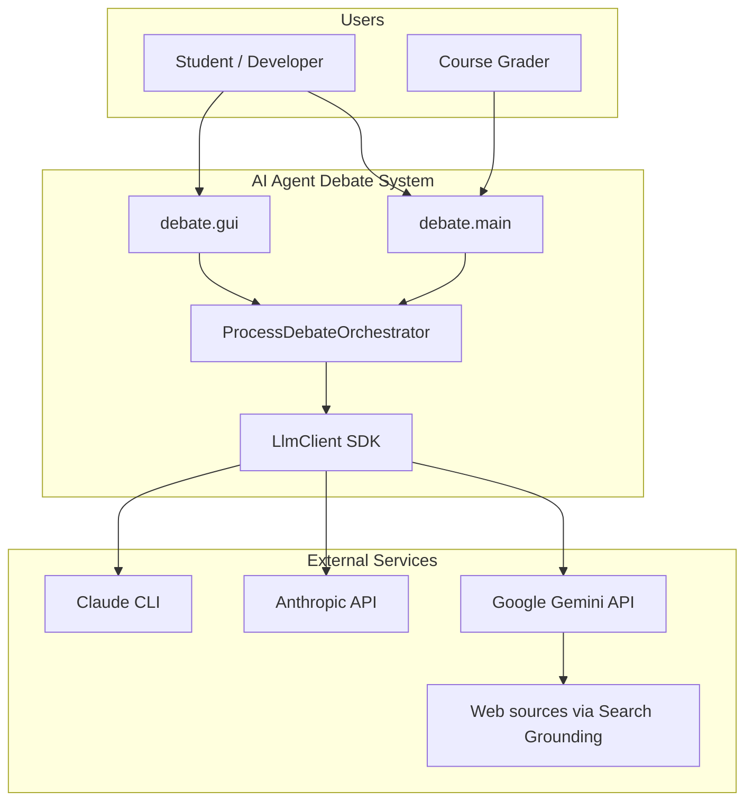
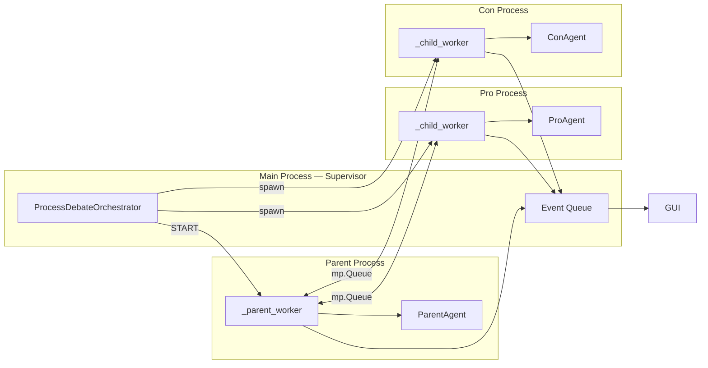
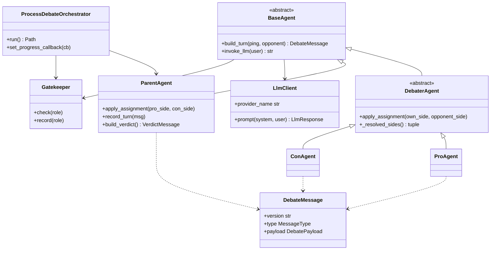

# Implementation Plan — AI Agent Debate

**Project:** Exercise 02 — Intelligent Agents  
**Version:** 1.00 (submission baseline)  
**Authors:** Renat Karimov, Alon Engel  
**Last updated:** 2026-05-27

---

## 1. Purpose

This document describes the **technical architecture**, design decisions, and phased delivery plan for the debate system. It complements `PRD.md` (what) with **how** we build and evolve the codebase toward Guidelines V3 compliance.

---

## 2. System context (C4 — Level 1)



---

## 3. Container view (C4 — Level 2)

| Container | Location | Responsibility |
|-----------|----------|----------------|
| CLI entry | `debate.main` | Argument parsing, config load, orchestrator start |
| GUI entry | `debate.gui` | Tkinter UI, live progress via event queue |
| Process orchestrator | `debate.orchestrator` | Multiprocess supervisor + parent/child workers |
| Agent workers | Child processes | Pro/Con LLM turns in isolation |
| Agent logic | `debate.agents` | Role prompts, turn building, JSON validation |
| Models | `debate.models` | Pydantic schemas for IPC |
| Transport (legacy) | `debate.transport` | File-queue / FIFO for single-process mode |
| Gatekeeper | `debate.gatekeeper` | Request budget enforcement |
| Watchdog | `debate.watchdog` | Process health monitoring |
| Logging | `debate.logging_setup` | Rotating JSONL logs |
| Config | `debate.config` | TOML loader (target: JSON in `config/`) |
| LLM SDK | `sdk.llm_client` | Unified provider facade |
| Gemini client | `sdk.gemini_client` | Gemini API + optional search |
| Claude client | `sdk.claude_client` | CLI + Anthropic API |

---

## 4. Component diagram — multiprocess orchestration



**Message path (one ping):**

1. Parent sends `TURN_REQUEST` to Pro queue.
2. Pro calls LLM via SDK, returns `DebateMessage` (type `turn`) to Parent.
3. Parent logs turn, sends `RELAY` to Con with Pro's argument.
4. Parent sends `TURN_REQUEST` to Con with opponent text.
5. Con returns turn; Parent relays to Pro for next ping.

---

## 5. Class diagram (core types)

See also `architecture.md` for the original single-process diagram. Current production path uses `ProcessDebateOrchestrator`.



---

## 6. IPC command protocol (process queues)

Worker processes exchange **dict commands** (internal) and **Pydantic models** (agent output):

| Command / payload | Direction | Meaning |
|-------------------|-----------|---------|
| `START` | Main → Parent | Begin debate loop |
| `STOP` | Main → workers | Graceful shutdown |
| `ASSIGN` | Parent → Pro/Con | `{own_side, opponent_side}` — runtime side assignment from `host_protocol.decide_sides`, sent once before any turn |
| `TURN_REQUEST` | Parent → Pro/Con | `{ping, opponent_text}` |
| `RELAY` | Parent → Pro/Con | Opponent's last message |
| `DebateMessage` (JSON) | Pro/Con → Parent | Completed turn |
| `ERROR` | Worker → Parent | Worker failure |

Public agent IPC (Exercise requirement) remains JSON `DebateMessage` / `VerdictMessage`.

---

## 7. Architecture Decision Records (ADRs)

### ADR-001: Mediated parent-only routing

**Status:** Accepted  
**Context:** Exercise forbids direct Pro↔Con communication.  
**Decision:** Parent process owns routing; Pro and Con only talk to Parent via queues.  
**Consequences:** Extra latency vs peer mesh; simpler grading verification.

### ADR-002: Multiprocessing with spawn

**Status:** Accepted  
**Context:** Exercise asks for separate agent processes; Windows dev environment.  
**Decision:** `multiprocessing.get_context("spawn")` with three persistent workers per session.  
**Consequences:** Higher startup cost; true process isolation; pickle-safe config objects required.

### ADR-003: SDK facade for all LLM providers

**Status:** Accepted  
**Context:** Guidelines require SDK layer; students use free Gemini tier.  
**Decision:** `LlmClient` selects Gemini / Anthropic / CLI; agents never import provider SDKs directly.  
**Consequences:** Single test mock point; easier provider swap.

### ADR-004: Config externalization

**Status:** Accepted (partial)  
**Context:** Feedback flagged configuration portability.  
**Decision:** All tunables in config files; migrate TOML → JSON in Stage 6.  
**Consequences:** Two-step migration; README documents both until complete.

### ADR-005: Gatekeeper as pre-call budget check

**Status:** Accepted (to be enhanced)  
**Context:** Exercise §8.6 + guidelines require rate limiting.  
**Decision:** Synchronous counter per role + global cap before each LLM call. Stage 7 adds queue + structured denial logging.  
**Consequences:** Simple MVP; not a full token-bucket yet.

### ADR-006: File length limit — split large modules

**Status:** Accepted  
**Context:** Guidelines V3 §5.2 — max 150 raw lines per code file (strict count, including blanks and comments).  
**Decision:** Split `process_orchestrator.py`, `agents.py`, `gui.py`, `orchestrator.py` in Stages 3–4. In Stage 13 we re-audited under the strict raw-line rule and split five more files: `transport.py` became a package, `parent_agent.py` extracted `verdict_builder.py` and `judge_prompts.py`, `legacy/session_loop.py` extracted `ping_runner.py`, `gui/app.py` extracted `env_check.py`, `gui/panels.py` extracted `form.py`.  
**Consequences:** More modules; clearer single responsibility. Audited at v1.00 — every source file ≤ 138 raw lines (`config/loader.py` is the canary for the next split).

### ADR-007: Runtime side assignment by the host

**Status:** Accepted  
**Context:** The exercise brief states that the debater's position must not be fixed in code — the host should hand it over in real time so the Parent visibly runs the debate.  
**Decision:** `ProAgent` and `ConAgent` are pure role markers (no built-in side); `host_protocol.decide_sides(config, session_id)` chooses which option each defends. The choice is deterministic per `session_id` (replayable) but varies across sessions. The result travels to children in an `ASSIGN` command before the first turn, and the Parent records the same mapping for its verdict prompt.  
**Consequences:** Tests can no longer assume "PRO = Godfather"; we added `tests/unit/test_host_protocol.py` to cover determinism, variability, and override paths.

### ADR-008: Multi-skill debaters + lore-only side skills

**Status:** Accepted  
**Context:** In-class clarification: each debater should have more than one skill — one for building arguments, one for refuting the opponent — modelled on a legal team where each lawyer specialises.  
**Decision:** Two generic, side-agnostic skills (`debate-argument-builder`, `debate-rebuttal-strategist`) carry the playbook; per-side skills (`debate-pro-godfather`, `debate-con-shawshank`) are now lore-only — curated facts and counter-points consumed by the generic skills. All skills live under `.claude/skills/` and are project-local (no global skills, per the exercise brief).  
**Consequences:** Side knowledge can be swapped in for new topics without touching the playbook; debaters share refutation discipline regardless of side.

### ADR-009: Research-backed judging rubric

**Status:** Accepted  
**Context:** The exercise brief says it is insufficient to declare the Parent "an expert" — its rubric must rest on published debate methodology.  
**Decision:** The Parent skill stack (`debate-parent-judge` + `debate-host-protocol` + `debate-judge-rubric`) and the verdict prompt are grounded in WUDC, IDEA, NSDA and Alfred Snider's published criteria, decomposed into five principles (persuasion-not-truth, clash, refute-with-citation, dropped-arguments-stand, no-tie) and a five-axis scoring rubric (Matter 30 / Manner 15 / Method 15 / Clash 25 / Burden 15). Documented in `docs/PRD_judge_rubric.md`.  
**Consequences:** Verdicts are auditable against a written rubric; `persuasion_notes` must reference at least one principle, which the prompt enforces.

### ADR-010: Config version key validated at load

**Status:** Accepted  
**Context:** Submission Guidelines V3 §8.1 require an explicit version stamp in code and config and a runtime check that they agree.  
**Decision:** `debate._version.__version__ = "1.00"` is the single source of truth; `setup.json`, `demo_setup.json`, `rate_limits.json`, and `demo_rate_limits.json` each carry a top-level `"version"` key. `debate.config.loader._validate_config_version` is called for both files inside `load_config`: missing key is a hard `ValueError`, mismatch is a warning so old configs still boot but the user is told.  
**Consequences:** Submitted artifacts can be diffed by version at a glance; CI-style mistakes (forgotten config bump) surface immediately at startup.

---

## 8. Directory structure (v1.00)

```
.claude/
  skills/
    debate-parent-judge/         # Parent: top-level role
    debate-host-protocol/        # Parent: opening protocol + side assignment
    debate-judge-rubric/         # Parent: scoring rubric
    debate-argument-builder/     # Debaters: positive case (side-agnostic)
    debate-rebuttal-strategist/  # Debaters: refutation rules (side-agnostic)
    debate-pro-godfather/        # Debaters: lore-only side knowledge
    debate-con-shawshank/        # Debaters: lore-only side knowledge
config/
  setup.json                     # version, debate, llm, ipc, logging
  demo_setup.json
  rate_limits.json               # version + gatekeeper limits
  demo_rate_limits.json
src/
  debate/
    _version.py                  # __version__ = "1.00" (single source of truth)
    agents/                      # parent, debater base, pro, con, prompts,
                                 # judge_prompts, verdict_builder, verdict_llm
    orchestrator/                # multiprocess workers + host_protocol
    gui/                         # optional Tkinter launcher
                                 #   app, layout, panels, form, env_check,
                                 #   widgets, theme, runner
    legacy/                      # single-process reference orchestrator
                                 #   session_loop, ping_runner, setup, helpers
    transport/                   # IPC transports
                                 #   base, file_queue, fifo, factory
    config/                      # JSON loader with version validation
    ...
  sdk/                           # provider facade + Gemini/Claude clients
tests/
  unit/
  integration/
assets/
  screenshots/
docs/
  PRD.md  PLAN.md  TODO.md  PROMPTS.md
  PRD_orchestrator.md  PRD_gatekeeper.md  PRD_llm_sdk.md  PRD_judge_rubric.md
  architecture.md  GEMINI_SETUP.md
```

---

## 9. Testing strategy

| Layer | Scope | Location |
|-------|-------|----------|
| Unit | Models, config, gatekeeper, SDK mocks | `tests/unit/` |
| Integration | Orchestrator flow with mocked LLM | `tests/integration/` |
| Smoke | `test_gemini.py` manual API check | `debate.test_gemini` |

**Coverage target:** 85% measured with `pytest-cov` after Stage 8.

---

## 10. Logging and observability

- **Session logs:** Rotating JSONL under `logs/` (`logging_setup.py`).
- **Verdict artifact:** `logs/verdict_<session_id>.json`.
- **GUI progress:** Event queue payloads (`kind`: `progress`, `llm_start`, `llm_done`, `ipc`, `error`).
- **Prompt log:** `docs/PROMPTS.md` documents every LLM-facing prompt (rationale, schema, iteration history).

---

## 11. Security

- API keys via `.env` only; placeholder detection in `LlmClient`.
- No secrets in config files committed to Git.
- `.gitignore` excludes `.env`, `logs/` (except samples if added).

---

## 12. Related documents

| Document | Description |
|----------|-------------|
| `PRD.md` | Product requirements |
| `TODO.md` | Staged task tracker |
| `PROMPTS.md` | Prompt book — every LLM-facing prompt, rationale, iteration history |
| `PRD_orchestrator.md` | Orchestrator mechanism spec |
| `PRD_gatekeeper.md` | Gatekeeper mechanism spec |
| `PRD_llm_sdk.md` | LLM SDK mechanism spec |
| `PRD_judge_rubric.md` | Research basis + skill architecture for Parent/Judge |
| `architecture.md` | Original class diagram + layers |
