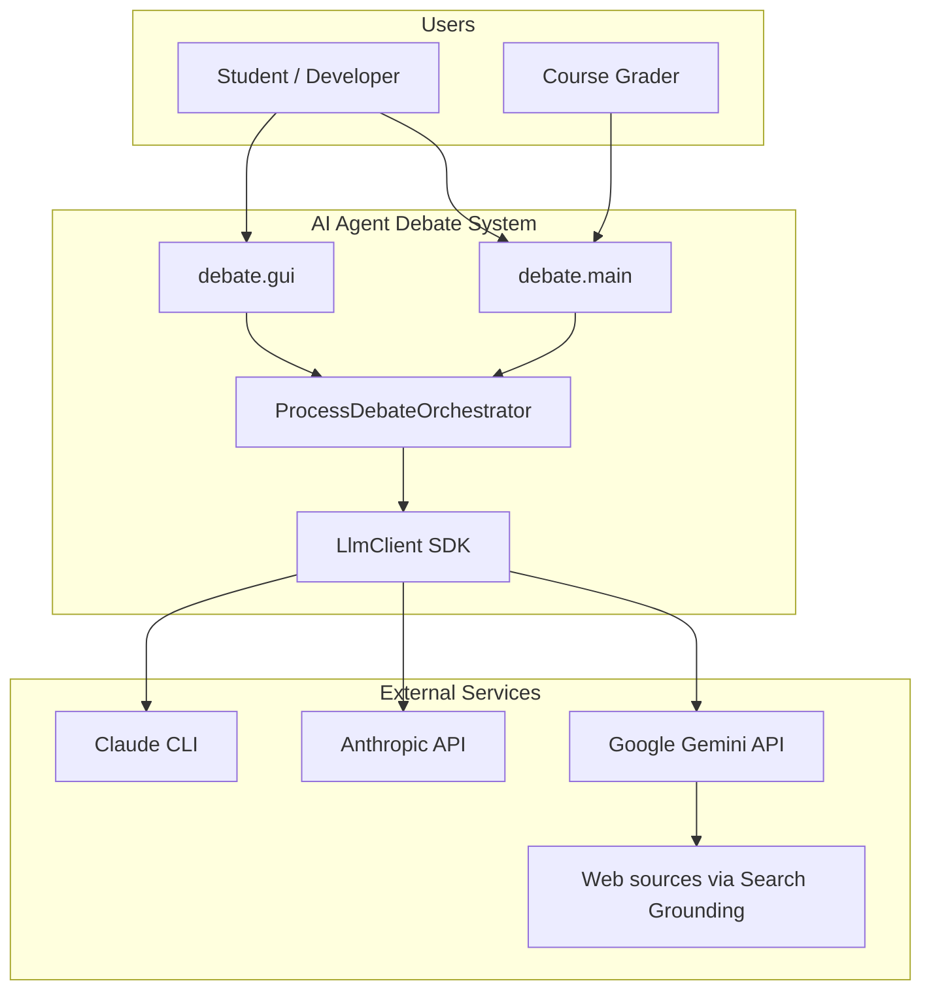
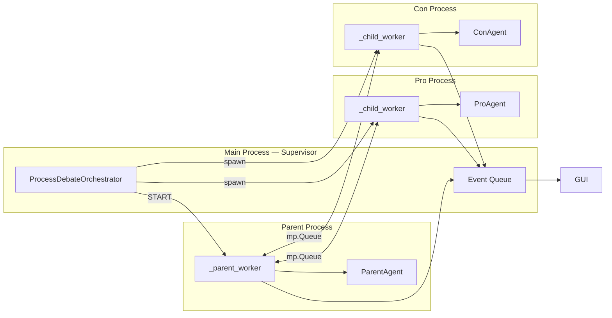
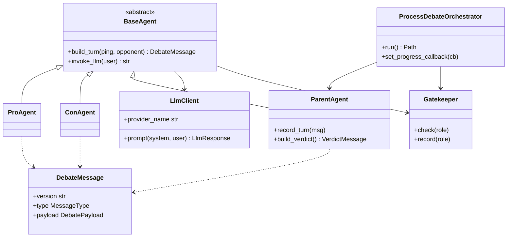

# Implementation Plan — AI Agent Debate

**Project:** Exercise 02 — Intelligent Agents  
**Version:** 1.00  
**Authors:** Renat Karimov, Alon Engel  
**Last updated:** 2026-05-21

---

## 1. Purpose

This document describes the **technical architecture**, design decisions, and phased delivery plan for the debate system. It complements `PRD.md` (what) with **how** we build and evolve the codebase toward Guidelines V3 compliance.

---

## 2. System context (C4 — Level 1)



---

## 3. Container view (C4 — Level 2)

| Container | Location | Responsibility |
|-----------|----------|----------------|
| CLI entry | `debate.main` | Argument parsing, config load, orchestrator start |
| GUI entry | `debate.gui` | Tkinter UI, live progress via event queue |
| Process orchestrator | `debate.process_orchestrator` | Multiprocess supervisor + parent worker |
| Agent workers | Child processes | Pro/Con LLM turns in isolation |
| Agent logic | `debate.agents` | Role prompts, turn building, JSON validation |
| Models | `debate.models` | Pydantic schemas for IPC |
| Transport (legacy) | `debate.transport` | File-queue / FIFO for single-process mode |
| Gatekeeper | `debate.gatekeeper` | Request budget enforcement |
| Watchdog | `debate.watchdog` | Process health monitoring |
| Logging | `debate.logging_setup` | Rotating JSONL logs |
| Config | `debate.config` | TOML loader (target: JSON in `config/`) |
| LLM SDK | `sdk.llm_client` | Unified provider facade |
| Gemini client | `sdk.gemini_client` | Gemini API + optional search |
| Claude client | `sdk.claude_client` | CLI + Anthropic API |

---

## 4. Component diagram — multiprocess orchestration



**Message path (one ping):**

1. Parent sends `TURN_REQUEST` to Pro queue.
2. Pro calls LLM via SDK, returns `DebateMessage` (type `turn`) to Parent.
3. Parent logs turn, sends `RELAY` to Con with Pro's argument.
4. Parent sends `TURN_REQUEST` to Con with opponent text.
5. Con returns turn; Parent relays to Pro for next ping.

---

## 5. Class diagram (core types)

See also `architecture.md` for the original single-process diagram. Current production path uses `ProcessDebateOrchestrator`.



---

## 6. IPC command protocol (process queues)

Worker processes exchange **dict commands** (internal) and **Pydantic models** (agent output):

| Command / payload | Direction | Meaning |
|-------------------|-----------|---------|
| `START` | Main → Parent | Begin debate loop |
| `STOP` | Main → workers | Graceful shutdown |
| `TURN_REQUEST` | Parent → Pro/Con | `{ping, opponent_text}` |
| `RELAY` | Parent → Pro/Con | Opponent's last message |
| `DebateMessage` (JSON) | Pro/Con → Parent | Completed turn |
| `ERROR` | Worker → Parent | Worker failure |

Public agent IPC (Exercise requirement) remains JSON `DebateMessage` / `VerdictMessage`.

---

## 7. Architecture Decision Records (ADRs)

### ADR-001: Mediated parent-only routing

**Status:** Accepted  
**Context:** Exercise forbids direct Pro↔Con communication.  
**Decision:** Parent process owns routing; Pro and Con only talk to Parent via queues.  
**Consequences:** Extra latency vs peer mesh; simpler grading verification.

### ADR-002: Multiprocessing with spawn

**Status:** Accepted  
**Context:** Exercise asks for separate agent processes; Windows dev environment.  
**Decision:** `multiprocessing.get_context("spawn")` with three persistent workers per session.  
**Consequences:** Higher startup cost; true process isolation; pickle-safe config objects required.

### ADR-003: SDK facade for all LLM providers

**Status:** Accepted  
**Context:** Guidelines require SDK layer; students use free Gemini tier.  
**Decision:** `LlmClient` selects Gemini / Anthropic / CLI; agents never import provider SDKs directly.  
**Consequences:** Single test mock point; easier provider swap.

### ADR-004: Config externalization

**Status:** Accepted (partial)  
**Context:** Feedback flagged configuration portability.  
**Decision:** All tunables in config files; migrate TOML → JSON in Stage 6.  
**Consequences:** Two-step migration; README documents both until complete.

### ADR-005: Gatekeeper as pre-call budget check

**Status:** Accepted (to be enhanced)  
**Context:** Exercise §8.6 + guidelines require rate limiting.  
**Decision:** Synchronous counter per role + global cap before each LLM call. Stage 7 adds queue + structured denial logging.  
**Consequences:** Simple MVP; not a full token-bucket yet.

### ADR-006: File length limit — split large modules

**Status:** Planned  
**Context:** Guidelines V3 — max 150 lines per code file.  
**Decision:** Split `process_orchestrator.py`, `agents.py`, `gui.py`, `orchestrator.py` in Stages 3–4.  
**Consequences:** More modules; clearer single responsibility.

---

## 8. Directory structure

### Current

```
src/
  debate/          # Application layer
  sdk/             # LLM SDK (provider isolation)
tests/             # pytest (flat)
docs/              # PRD, PLAN, TODO, architecture
.claude/skills/    # Per-agent skills
config.toml
config.demo.toml
```

### Target (after Stages 2–6)

```
config/
  setup.json
  rate_limits.json
src/
  debate/
    orchestrator/   # split process modules
    agents/
    ...
  sdk/
tests/
  unit/
  integration/
assets/
  screenshots/
docs/
```

---

## 9. Testing strategy

| Layer | Scope | Location |
|-------|-------|----------|
| Unit | Models, config, gatekeeper, SDK mocks | `tests/unit/` |
| Integration | Orchestrator flow with mocked LLM | `tests/integration/` |
| Smoke | `test_gemini.py` manual API check | `debate.test_gemini` |

**Coverage target:** 85% measured with `pytest-cov` after Stage 8.

---

## 10. Logging and observability

- **Session logs:** Rotating JSONL under `logs/` (`logging_setup.py`).
- **Verdict artifact:** `logs/verdict_<session_id>.json`.
- **GUI progress:** Event queue payloads (`kind`: `progress`, `llm_start`, `llm_done`, `ipc`, `error`).
- **Future (Stage 9):** Prompt log file + token/cost summary in README.

---

## 11. Security

- API keys via `.env` only; placeholder detection in `LlmClient`.
- No secrets in config files committed to Git.
- `.gitignore` excludes `.env`, `logs/` (except samples if added).

---

## 12. Related documents

| Document | Description |
|----------|-------------|
| `PRD.md` | Product requirements |
| `TODO.md` | Staged task tracker |
| `PRD_orchestrator.md` | Orchestrator mechanism spec |
| `PRD_gatekeeper.md` | Gatekeeper mechanism spec |
| `PRD_llm_sdk.md` | LLM SDK mechanism spec |
| `architecture.md` | Original class diagram + layers |
