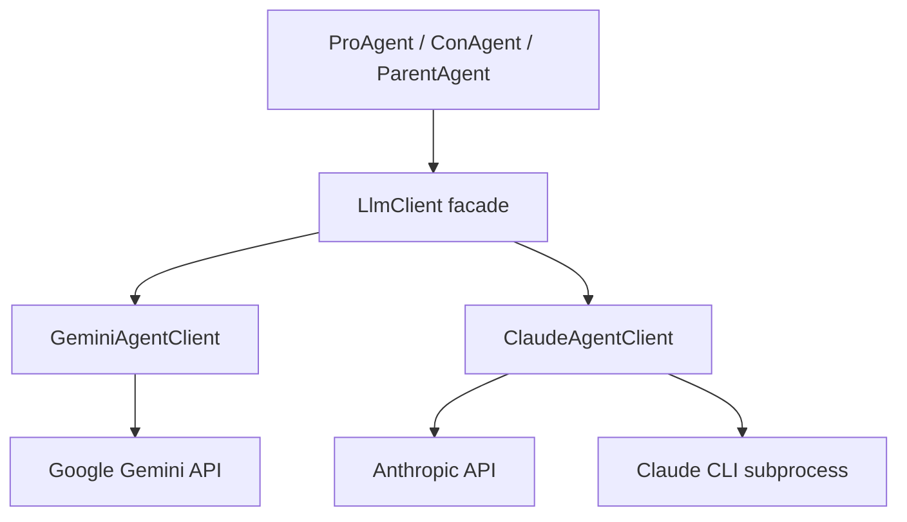

# Mechanism PRD — LLM SDK Layer

**Component:** `LlmClient`  
**Modules:** `sdk.llm_client`, `sdk.gemini_client`, `sdk.claude_client`  
**Version:** 1.00  
**Authors:** Renat Karimov, Alon Engel  
**Last updated:** 2026-05-21

---

## 1. Summary

The LLM SDK layer is the **only approved path** from application code to language models. Agents and orchestrators must not import `google.genai` or `anthropic` directly. The facade selects a provider, normalizes responses, and centralizes timeout and credential handling.

---

## 2. Goals

1. **Provider abstraction** — swap Gemini, Anthropic API, or Claude CLI without changing agent code.
2. **Student-friendly defaults** — prefer free Gemini when `GEMINI_API_KEY` is set.
3. **Safe configuration** — ignore placeholder keys in `.env`.
4. **Testability** — mock a single `LlmClient.prompt` in integration tests.
5. **Exercise compliance** — internet citations via Gemini search grounding when enabled.

---

## 3. Architecture



---

## 4. Public API

### `LlmResponse`

| Field | Type | Description |
|-------|------|-------------|
| `text` | str | Model text output (parsed JSON or prose) |
| `raw` | str | Raw provider payload / debug |
| `provider` | str | `"gemini"`, `"anthropic"`, or `"claude_cli"` |

### `LlmClient`

```python
class LlmClient:
    def __init__(
        self,
        cli_command: str = "claude",
        workdir: Path | None = None,
        timeout_seconds: int = 120,
        gemini_model: str = "gemini-2.5-flash",
        gemini_fallback_models: tuple[str, ...] = (),
        use_google_search: bool = False,
    ) -> None: ...

    def prompt(self, system: str, user: str) -> LlmResponse: ...

    @property
    def provider_name(self) -> str: ...
```

---

## 5. Provider resolution

Controlled by environment variable `LLM_PROVIDER`:

| Value | Behavior |
|-------|----------|
| `auto` (default) | First available: Gemini key → Anthropic key → Claude CLI |
| `gemini` | Require valid `GEMINI_API_KEY`; error if missing |
| `anthropic` | Require valid `ANTHROPIC_API_KEY` |
| `claude_cli` | Force CLI subprocess path |

### Placeholder detection

Keys containing markers like `your-key`, `paste`, `sk-ant-your`, `example` are treated as **unset** to avoid silent failures during setup.

---

## 6. Gemini client (`GeminiAgentClient`)

### Responsibilities

- Call Gemini generate API with system + user content.
- Optional **Google Search grounding** when `use_google_search=true`.
- Model fallback chain on recoverable errors (429, model unavailable).
- Return text suitable for agent JSON parsing.

### Configuration (from `config.toml`)

| Key | Default | Notes |
|-----|---------|-------|
| `llm.gemini_model` | `gemini-2.5-flash` | Primary model |
| `llm.gemini_model_fallbacks` | lite + 1.5 flash | Ordered fallbacks |
| `llm.use_google_search` | `true` (full) | Required for citation exercise; disable if quota blocks |

### Citations

When search grounding is active, agents extract URLs from model output into `Citation` objects in `DebatePayload`. Prompts in skills instruct JSON shape including `citations[]`.

---

## 7. Claude client (`ClaudeAgentClient`)

### Responsibilities

- **Anthropic API** path when `ANTHROPIC_API_KEY` is valid.
- **CLI fallback** via subprocess (`claude` command) for local dev without API key.
- Respect `timeout_seconds` and working directory for skill discovery.

### When used

- Production runs with Anthropic credits.
- Fallback when Gemini unavailable and user sets `LLM_PROVIDER=anthropic` or `claude_cli`.

---

## 8. Agent integration contract

Agents call:

```python
response = self._client.prompt(system=self.system_prompt(), user=user_message)
text = response.text
```

Agents are responsible for:

- Building system prompt (role + topic + JSON schema instructions).
- Parsing model output into `DebateMessage` / verdict structures.
- Invoking gatekeeper around the call.

SDK is responsible for:

- Network / subprocess errors wrapped as exceptions.
- Provider selection and timeouts.
- Returning unified `LlmResponse`.

---

## 9. Environment and secrets

| Variable | Required for | Notes |
|----------|--------------|-------|
| `GEMINI_API_KEY` | Gemini | Free tier from AI Studio |
| `ANTHROPIC_API_KEY` | Anthropic API | Optional |
| `LLM_PROVIDER` | Override auto | `auto`, `gemini`, `anthropic`, `claude_cli` |

Loaded via `debate.env_loader` / `python-dotenv` from `.env`. Repository ships `.env.example` only.

---

## 10. Smoke test entry point

`python -m debate.test_gemini`

- Loads env, constructs `LlmClient`, sends single prompt.
- Prints provider and success/failure — used before full debate runs.

---

## 11. Error handling

| Error | Handling |
|-------|----------|
| Missing key for forced provider | `RuntimeError` with setup URL |
| API 429 / quota | Gemini tries fallback models; then raise |
| Timeout | Subprocess / HTTP timeout after `timeout_seconds` |
| Invalid JSON from model | Agent-level parse error → turn failure |

---

## 12. Non-functional requirements

| ID | Requirement |
|----|-------------|
| SDK-01 | No provider imports outside `src/sdk/` |
| SDK-02 | All network calls respect timeout config |
| SDK-03 | Log provider name at session start (dry-run + main) |
| SDK-04 | Compatible with Windows paths for CLI workdir |

---

## 13. Test requirements

| Test | Location |
|------|----------|
| Placeholder key ignored | `tests/test_llm_client.py` |
| Provider forced via env | `tests/test_llm_client.py` |
| Mock Gemini success path | unit (expand Stage 8) |
| Fallback model selection | unit (expand Stage 8) |

---

## 14. Future work

| Item | Stage |
|------|-------|
| Token usage capture on `LlmResponse` | Stage 9 |
| Prompt log file per session | Stage 9 |
| Cost estimate helper in README | Stage 9 |
| Retry policy config in JSON | Stage 6 |

---

## 15. Acceptance criteria

- [x] Unified `LlmClient` facade implemented.
- [x] Gemini + Anthropic + CLI paths available.
- [x] Auto provider selection with placeholder guard.
- [x] `test_gemini` smoke script works with valid key.
- [ ] Token counts exposed for cost analysis (Stage 9).
- [ ] 85% SDK branch coverage (Stage 8).

---

## 16. Related documents

- `docs/GEMINI_SETUP.md` — student setup guide
- `PRD.md` — FR-15 through FR-18
- `PLAN.md` — ADR-003
