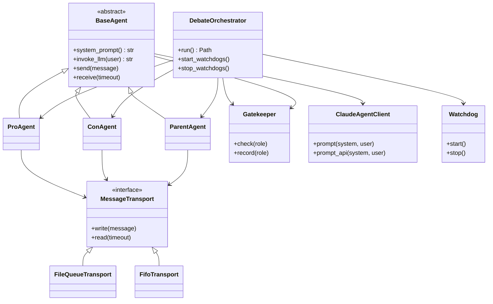

# Architecture — AI Agent Debate (Exercise 02)

**Team:** Renat Karimov, Alon Engel  
**Default topic:** The Godfather vs The Shawshank Redemption (the engine is topic-agnostic — any motion via `--topic`)

## Class diagram (Mermaid)



## Message flow

```
Pro Agent  --JSON-->  [pro_to_parent]  -->  Parent  --JSON-->  [parent_to_con]  -->  Con Agent
Con Agent  --JSON-->  [con_to_parent]  -->  Parent  --JSON-->  [parent_to_pro]  -->  Pro Agent
```

No direct Pro ↔ Con channel.

## Layers

| Layer | Package | Responsibility |
|-------|---------|----------------|
| Terminal / CLI | `debate.main` | `python -m debate.main` entry |
| Orchestration | `debate.orchestrator` | Turn loop, pings, verdict file |
| Agents | `debate.agents` | Role-specific prompts and JSON |
| IPC | `debate.transport` | FIFO (Unix) or file queues (Windows) |
| SDK | `sdk.claude_client` | Claude CLI / API isolation |
| Cross-cutting | `gatekeeper`, `watchdog`, `logging_setup` | Budget, health, rotating JSONL logs |

## Configuration

All tunables live in `config/setup.json` and `config/rate_limits.json` (no hardcoded debate parameters in code).
